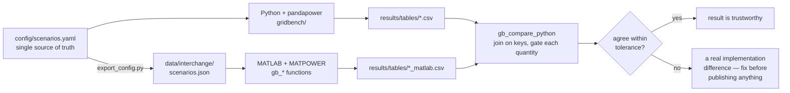
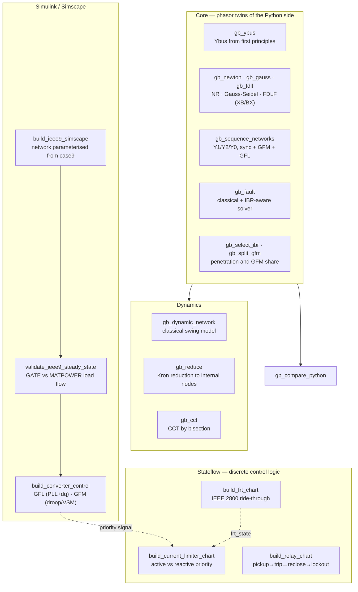
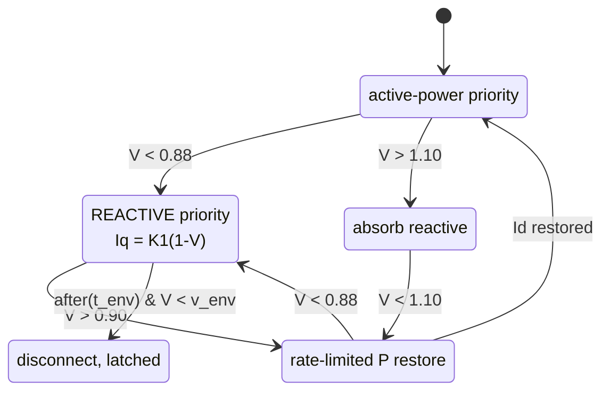
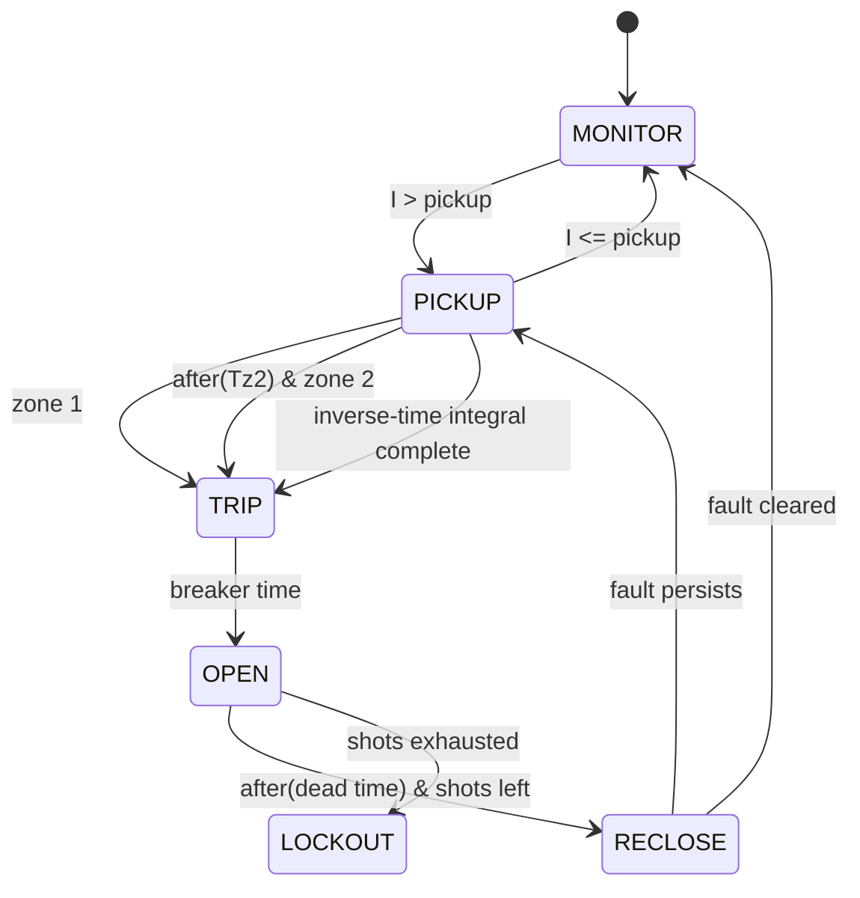

# IEEE IBR Benchmark — MATLAB / MATPOWER / Simulink / Stateflow

**The MATLAB half of a cross-tool power systems benchmark.** Independently
reimplements the phasor studies to cross-validate the Python side, and adds the
converter control and dynamic work that only Simulink and Stateflow can do.


```matlab
cd IEEE/matlab
setup_paths              % adds paths, checks MATPOWER + config bridge
wp1_baseline_matlab      % classical load flow
wp3_faults_matlab        % faults + grid-forming mitigation
wp7_transient_matlab     % transient stability + CCT
gb_compare_python        % diff MATLAB against Python
```

---

## Why a second implementation

A single implementation cannot validate itself. If Python says the fault current
at bus 16 is 22.65 pu, the only way to know that is not a bug is for an
independent implementation, written from the same equations but not the same
code, to agree.

Both sides read the **same** `config/scenarios.yaml` through a JSON bridge, solve
the **same** MATPOWER cases, and write the **same** CSV column names — so
`gb_compare_python` can join them on shared keys and pass/fail each quantity
against `config/tolerances.yaml`.



**Why write our own solvers when `runpf` exists.** Two reasons. `runpf` is a
black box — it will not report its Jacobian condition number, its mismatch
history, or how many iterations Gauss-Seidel needed at a given acceleration
factor. And an interviewer asking whether you understand load flow is asking
about the derivation, not the API. `gb_newton` builds the polar Jacobian from
∂S/∂|V| and ∂S/∂θ explicitly.

---

## What's here



| Folder | Files | Purpose |
|---|---|---|
| `matpower/` | `gb_newton`, `gb_gauss`, `gb_fdlf`, `gb_dynamic_network`, `gb_reduce`, `gb_cct`, 2 drivers | solvers + transient stability |
| `faults/` | `gb_sequence_networks`, `gb_fault`, `gb_inverter_rating`, driver | short-circuit analysis |
| `ibr/` | `gb_select_ibr`, `gb_split_gfm` | penetration scenarios |
| `simulink/` | `build_ieee9_simscape`, `validate_ieee9_steady_state`, `build_converter_control` | EMT-side network + control |
| `stateflow/` | 3 chart builders | discrete control logic |
| `compare/` | `gb_compare_python` | cross-tool diff |
| `utils/` | `gb_config`, `gb_ybus`, `gb_root`, `gb_writetable`, `gb_wrap_deg` | shared plumbing |

---

## Setup

### 1. MATPOWER (required, free, not bundled with MATLAB)

```matlab
% download MATPOWER 8.x from https://matpower.org, unzip to e.g. C:\matpower8
addpath(genpath('C:\matpower8')); savepath
test_matpower            % expect all tests to pass
```

### 2. The config bridge (before your first MATLAB run)

MATLAB's YAML support varies by release, so the shared YAML is mechanically
translated to JSON:

```bash
cd IEEE/python
python studies/export_config.py
```

Re-run after any config change. `gb_config` **errors** rather than silently
using stale values if you forget.

### 3. Every session

```matlab
cd IEEE/matlab
setup_paths              % tells you exactly what is missing, if anything
```

Toolbox check:

```matlab
license('test','Simulink'); license('test','Simscape_Electrical'); license('test','Stateflow')
```

Simscape Electrical is needed **only** for the EMT work. Everything in the
phasor and transient studies runs without it.

---

## Stateflow — the part worth looking at

Three charts implement behaviour that is genuinely discrete and event-driven —
mode changes, latching, timers, counted retries. A Simulink block diagram of
switches models this badly; Stateflow is the right tool and the charts read
close to the standard.

### FRT / ride-through (`build_frt_chart`)



The critical behaviour is the **priority flip**. In `NORMAL` the converter runs
active-power priority (you are paid for MWh). On entering `LVRT` it switches to
**reactive priority** — this is what IEEE 2800 requires, and it is the mechanism
that keeps negative-sequence current available to the protection relays
downstream. The ride-through envelope is read from `scenarios.yaml`, so the
chart and the Python fault solver enforce the same curve.

**Verify:** a 120 ms dip at 0.2 pu → `state_id` 0→1→3→0, never 4. A 200 ms dip →
reaches 4 (TRIPPED). If a 120 ms dip trips, the envelope is wired wrong.

### Current limiter (`build_current_limiter_chart`)

When the command exceeds the limit, something has to give:

| Mode | Keeps | Correct when |
|---|---|---|
| ACTIVE_PRIORITY | P, curtails Q | normal operation |
| REACTIVE_PRIORITY | Q, curtails P | **during a fault** — IEEE 2800 |
| BALANCED | power factor | simple, wrong in both regimes |

**Verify:** `Id_cmd = 1.0, Iq_cmd = 0.8` (magnitude 1.28 > 1.20).
Active priority → Id = 1.00, Iq = 0.663. Reactive priority → Iq = 0.80,
Id = 0.894.

### Relay (`build_relay_chart`)



Inverse-time is integrated rather than looked up, which is the correct handling
for a current that varies during the fault.

**The IBR connection.** The protection study found the dominant failure mode is
not a mis-timed trip but **no pickup at all** — inverter-limited fault current
never reaches the threshold. Drive this chart with `Imag = 1.1 pu` and it never
leaves `MONITOR` while the fault persists. That is the failure, made visible.

---

## Simscape — and the gate that matters

```matlab
build_ieee9_simscape          % parameterises every block from case9
% ... wire the blocks in the GUI ...
validate_ieee9_steady_state   % MUST PASS
```

The builder sets line R/L/C from branch data, loads from bus data, and source
impedances from the same assumed short-circuit level the phasor studies use. It
**does not draw the wires** — connections are far more reliable to make in the
GUI, and a scripted wiring routine breaks between releases.

> **`validate_ieee9_steady_state` is not optional.** A transient simulation
> answers "what happens after the disturbance". If the operating point it starts
> *from* is wrong, so is the answer, at any timestep. The gate compares the
> settled model against `gb_newton` and fails with a ranked list of likely
> causes.

---

## Transient stability — read this before quoting a CCT

`wp7_transient_matlab` computes critical clearing time by bisection on the
classical swing model.

> ⚠️ **CCT is not comparable across scenarios with different numbers of dynamic
> units.** The criterion is rotor-angle separation, which only exists for units
> that *have* a rotor angle. Converting a machine to a grid-following converter
> deletes it from the swing model, so the metric loses the failure mode it exists
> to detect. Measured on IEEE 39-bus: CCT "improves" from 0.121 s at 0% IBR to
> 0.977 s at 40.6% grid-following penetration. **That is an artefact.**
>
> A grid-following converter destabilises through PLL loss of synchronisation —
> a converter-control phenomenon an electromechanical model cannot represent.

**The valid comparison** is the virtual-inertia sweep: fixed topology, fixed
dispatch, fixed unit count, only grid-forming inertia varies → **4.1× longer
CCT**.

Machine data comes from `machine_dynamics` in `scenarios.yaml` — Anderson &
Fouad for case9, Athay et al. for case39, already referred to 100 MVA. A generic
inertia constant instead gives a CCT roughly **4× too long**; this is one place
where invented data quietly wrecks the result.

---

## Cross-tool validation

```matlab
gb_compare_python
```

Joins each MATLAB table with its Python counterpart on shared keys and gates
each quantity:

| Quantity | Tolerance |
|---|---|
| WP1 solver iterations | exact |
| WP1 \|ΔVm\| vs reference solver | 1e-6 pu |
| WP3 classical fault current | 1e-6 pu |
| WP3 IBR-aware fault current | 1e-3 pu |
| WP5 well-posed fraction | exact |

A failure means the two toolchains disagree on the same problem. **Fix that
before trusting any downstream result.**

---

## Contributing

Welcome. Ground rules:

1. **Nothing hard-coded** — parameters go in `config/scenarios.yaml`, read via
   `gb_config`. Never duplicate config in a `.m` file; it will drift.
2. **Mirror the Python API.** A new `gb_*` function should match its
   `gridbench/` counterpart's inputs, outputs and column names, so
   `gb_compare_python` can diff it.
3. **Document the physics in the header.** Every function here explains *why*
   the model is what it is, not just what it does. Keep that.
4. **Validate against MATPOWER** where a reference exists (`makeYbus`, `runpf`).

**Open work**

| Area | What's needed | Difficulty |
|---|---|---|
| **Wire the Simscape network** | connections + signal logging; builder already sets parameters | medium |
| **Couple Stateflow to Simscape** | drive converter current refs from the FRT chart | medium |
| **EMT CCT** | reproduce the 4.1× virtual-inertia result in EMT | hard |
| **PSCAD export** | Thevenin POI equivalent from `gb_ybus` (15-node cap) | hard |
| **DIgSILENT / ETAP** | DPL scripts / project files (50 and 15 bus caps) | medium |
| **`gb_protection`** | MATLAB twin of `gridbench/protection.py` | easy |
| **Exciter + governor** | lift the transient model above classical | medium |

---

## Licence caps to design around

| Tool | Cap | Consequence |
|---|---|---|
| ETAP Student | **15 buses** | IEEE 9-bus only |
| PSCAD Free | **15 nodes** | Thevenin-reduced POI equivalent |
| DIgSILENT PF4S | **50 nodes**, ~€150/yr | IEEE 39-bus fits |

case9 is the only system that fits every cap — which is why it is the Simscape
workhorse.

---

## License

MIT.

## Author

**Mukesh Singh** — power, energy and EV systems.

The Python / pandapower half of this project is documented in `PYTHON.md`.
