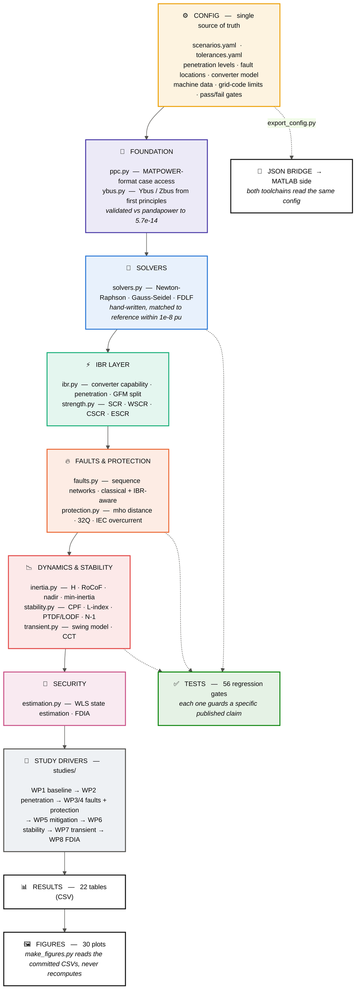
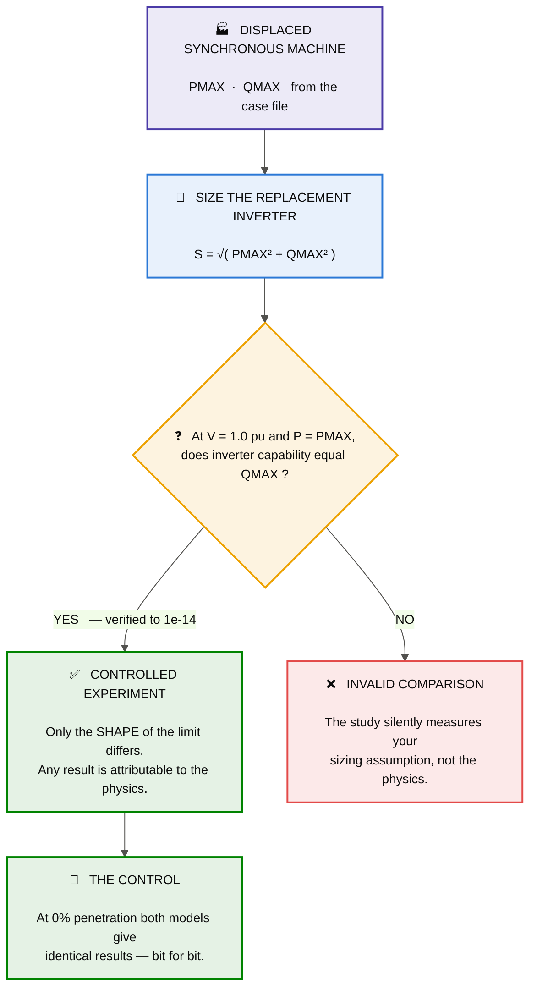
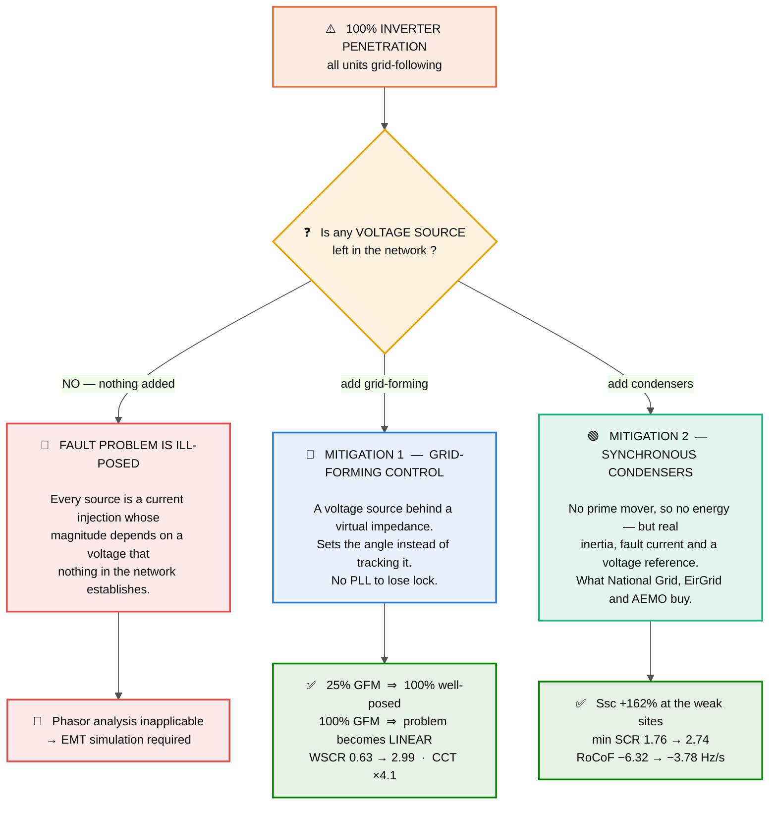

<div align="center">

# IEEE IBR Benchmark — Python / pandapower

**Where does classical power system analysis stop being trustworthy as inverters replace synchronous machines?**

This repository measures that boundary on the standard IEEE 9 / 14 / 30 / 39-bus test systems — and then measures what fixes it.

[](https://www.python.org/)
[](https://www.pandapower.org/)
[](#reproducing)
[](#license)

</div>

```bash
git clone https://github.com/MukeshSingh123-tech/ieee-ibr-benchmark.git
cd ieee-ibr-benchmark/python
pip install -r ../requirements.txt

python run_all.py           # 9 studies, 22 tables, 30 figures, ~10 min
python -m pytest tests/ -q  # 56 regression gates
```

---

## Contents

- [Why this exists](#why-this-exists)
- [Architecture](#architecture)
- [The core experiment](#the-core-experiment)
- [Results](#results)
- [Mitigation — what fixes it](#mitigation--what-fixes-it)
- [Reproducing](#reproducing)
- [Positioning — what this is and is not](#positioning--what-this-is-and-is-not)
- [Stated limitations](#stated-limitations)
- [Contributing](#contributing)
- [Repository layout](#repository-layout)
- [License](#license) · [Author](#author)

---

## Why this exists

The textbook version of this project — Newton–Raphson load flow plus symmetrical-component fault analysis — has been solved since the 1980s. What is *not* settled is that those exact methods are degrading as inverter-based resources (IBRs) displace synchronous machines.

| Classical assumption | What actually happens with IBRs |
| :--- | :--- |
| Generators are voltage sources behind X″ | IBRs are **current-limited** (~1.1–1.2 pu); fault current collapses instead of spiking |
| Sequence networks are independent | Negative-sequence current is a **control choice** (IEEE Std 2800-2022), not a machine property |
| PV buses hold voltage with fixed Qmax | Qmax = √((V·I<sub>lim</sub>·S)² − P²) — it **moves** with voltage and power |
| Fault current is large and inductive | Distance and directional elements **misoperate** |
| Inertia comes free with generation | An inverter contributes **zero** inertia; RoCoF ∝ 1/H |

This project measures each of those rather than asserting them.

> [!NOTE]
> **Scope.** These effects are known and documented in the literature. The contribution here is **quantification on standard benchmarks with a fully reproducible pipeline**, not new physics. See [Positioning](#positioning--what-this-is-and-is-not).

---

## Architecture



**The design rule:** nothing hard-codes a penetration level, fault location, current limit or tolerance. It lives in `config/scenarios.yaml` or it does not exist. Figures are generated from the committed CSVs rather than recomputed, so a number in the report and the same number in a plot cannot disagree.

---

## The core experiment

Classical and IBR-aware power flow differ in **exactly one** respect:

```text
classical:   Qmax = constant, read from the case file
IBR-aware:   Qmax(V, P) = sqrt((V · Ilim · S)² − P²)     ← moves with V and P
```



This matters. An earlier version inferred the inverter nameplate independently and handed it **more** reactive capability than the machine it replaced (33 vs 24 MVAr on IEEE 14-bus buses 6 and 8) — the study was silently measuring the sizing choice. `test_inverter_sizing_matches_machine_capability` now guards it.

---

## Results

All numbers are reproduced by `python run_all.py`; tables land in `results/tables/`. IEEE 39-bus is the primary case — 10 dispatched machines, so it supports a meaningful penetration sweep.

### 1 · Solver baseline (WP1)

| case | n_bus | NR | Gauss-Seidel | FDXB | FDBX |
| :--- | ---: | ---: | ---: | ---: | ---: |
| case9 | 9 | **4** | 74 | 10 | 9 |
| case14 | 14 | **4** | 77 | 10 | 13 |
| case30 | 30 | **4** | 247 | 14 | 9 |
| case39 | 39 | **4** | **diverges** | 12 | 13 |

Newton–Raphson takes 4 iterations regardless of system size. Gauss-Seidel scales badly *and* depends on an acceleration factor Newton has no equivalent of — on case39 it converges at accel ≤ 1.4 and fails at 1.6.

Ybus matches pandapower to **5.7e-14**; hand-written solvers match to **< 1e-8 pu**.

### 2 · System strength collapses early (WP2)

IEEE 39-bus breaches the **SCR ≥ 3.0** interconnection screen at just **28.9%** penetration:

| penetration | min SCR | WSCR | weak buses |
| ---: | ---: | ---: | ---: |
| 28.9% | 2.85 | 2.32 | 1 |
| 40.6% | 1.80 | 1.12 | 2 |
| 68.5% | 1.78 | 0.63 | 2 |
| 84.0% | 1.76 | 0.45 | 2 |

### 3 · The steady-state error flips sign

At the **nominal** operating point the two models agree *exactly* (0.00000 pu) — the current limit never binds. It binds under stress:

| load × | 0% | 20% | 40% | 60%+ |
| :--- | ---: | ---: | ---: | ---: |
| ×1.00 | 0.00000 | 0.00000 | 0.00000 | 0.00000 |
| ×1.20 | 0.00000 | 0.05334 | 0.09098 | 0.09098 |
| ×1.30 | 0.00000 | 0.14358 | **0.23381** | **0.23381** |

The 0% column is exactly zero by construction — the experimental control.

> **Sweeping penetration alone finds nothing.** That is itself worth knowing: a study designed that way would conclude there is no problem.

### 4 · Fault current falls, angle moves (WP3)

| penetration | 3LG | SLG | LL | LLG |
| ---: | ---: | ---: | ---: | ---: |
| 28.9% | −13.3% | −11.2% | −11.6% | −11.7% |
| 68.5% | −33.2% | −26.1% | −27.3% | −27.4% |
| 84.0% | **−62.5%** | −51.6% | −55.2% | −55.5% |

Fault-current **angle** shifts −13° to −37° — what directional elements key on.

### 5 · Protection misoperates (WP4)

Relays commissioned from a classical study, evaluated against IBR-aware faults:

| penetration | cases | misoperations | rate |
| ---: | ---: | ---: | ---: |
| 40.6% | 44 | 2 | 4.5% |
| 68.5% | 44 | 25 | **56.8%** |
| 84.0% | 35 | 32 | **91.4%** |

Dominant modes: overcurrent **slower** (130), **fails to pick up at all** (11), directional **reversed** (3) or **blinded** (2).

### 6 · Inertia disappears (WP5)

| penetration | H_sys (s) | RoCoF (Hz/s) |
| ---: | ---: | ---: |
| 0% | 4.70 | −1.01 |
| 68.5% | 1.48 | −3.22 |
| 84.0% | 0.75 | **−6.32** |

At a 2.0 Hz/s limit the maximum admissible penetration is **40.6%**.

---

## Mitigation — what fixes it



### Grid-forming control restores a solvable system

IEEE 39-bus at **100% IBR penetration**:

| GFM share | voltage-source buses | well-posed | converged | mean fault current |
| ---: | ---: | ---: | ---: | ---: |
| 0% | 0 | **0%** | **0%** | — |
| 25% | 2 | 100% | 94% | 34.5 pu |
| 50% | 4 | 100% | 94% | 42.5 pu |
| 100% | 10 | 100% | 100% | 67.5 pu |

**25% grid-forming makes a 100%-inverter grid analysable again.** At 100% GFM the problem becomes *linear* and solves in one step.

System strength recovery (WSCR):

| case | 0% GFM | 25% | 50% | 75% | 100% |
| :--- | ---: | ---: | ---: | ---: | ---: |
| case39 @ 68.5% IBR | 0.63 | 1.57 | 2.07 | 2.72 | **2.99** |
| case39 @ 100% IBR | 0.38 | 0.72 | 1.06 | 1.44 | 1.73 |

At 68.5% penetration a fully grid-forming fleet restores WSCR to **2.99** — essentially back to the SCR ≥ 3.0 screen.

### Transient stability (WP7)

Fixed topology, dispatch and **dynamic-unit count**; only virtual inertia varies:

| H_virtual (s) | 0.5 | 1 | 2 | 4 | 8 | 16 |
| :--- | ---: | ---: | ---: | ---: | ---: | ---: |
| CCT @ 68.5% IBR | 0.090 | 0.137 | 0.246 | 0.207 | 0.387 | 0.367 |

**4.1× longer CCT.** Baseline validates at 0.121 s on intact IEEE 39-bus against a published ~0.15 s.

> [!WARNING]
> **A metric that breaks.** Sweeping *grid-following* penetration makes CCT appear to *improve* (0.121 → 0.977 s). That is an artefact: converting a machine deletes its rotor, and rotor-angle separation is the criterion being measured — the metric loses the failure mode it exists to detect. GFL instability is **PLL loss of synchronisation**, which an electromechanical model cannot represent. `critical_clearing_time` returns `n_dynamic_units` so the invalid comparison cannot be made silently.

### Security (WP8)

IEEE 39-bus, χ² threshold **J = 172.7**, clean **J = 153.4**. A random attack yields **J = 1632 — detected**.

| attack | 2° | 5° | 10° | 20° |
| :--- | ---: | ---: | ---: | ---: |
| FDIA linearised (DC) — J | 280 | 4931 | 71149 | 719043 |
| → detected? | ✅ yes | ✅ yes | ✅ yes | ✅ yes |
| FDIA **exact (AC)** — J | 153.31 | 153.26 | 153.28 | 153.58 |
| → detected? | **no** | **no** | **no** | **no** |
| → operator state error | 1.99° | 5.00° | 10.00° | 20.00° |

The exact attack leaves J indistinguishable from clean at every magnitude — a 20° corruption of the operator's state with no alarm. The defence fails structurally: `a = h(x+c) − h(x)` is exactly consistent with a state the estimator will believe, so **there is no residual to test**.

---

## Reproducing

```bash
python run_all.py --list        # what will run
python run_all.py --fast        # skip the slow studies
python run_all.py --only wp3_faults
python run_all.py               # everything, ~10 min
python -m pytest tests/ -q      # 56 gates
```

Every figure is regenerated from the committed CSVs. **If a figure cannot be rebuilt by `make_figures.py`, it does not go in the report.**

---

## Positioning — what this is and is not

**This is:** a reproducible, gated, cross-validated benchmark that puts numbers on effects the literature describes qualitatively, with a controlled experimental design and an explicit assumption register.

**This is not:** new physics. The underlying phenomena are documented — [IEEE Std 2800-2022](https://standards.ieee.org/ieee/2800/10453/) on IBR interconnection, NERC guidance on low-short-circuit-strength systems, WECC's IBR modelling guideline, and Liu, Ning & Reiter (2009) on FDIA. Where a result restates published work, `docs/PORTFOLIO_ENTRY.md` says so.

**Honest negative results are kept**, not deleted:

- `ieee2800_reduces_misoperation` — **not confirmed**. Helps at 68.5% penetration (56.8% → 50.0%), slightly worse at 84% (91.4% → 94.3%). By then fault current is too low for negative-sequence support to restore relay pickup; the binding constraint has moved from sequence content to magnitude.
- `cct_comparable_across_penetration` — **refuted**, with the mechanism documented and guarded in code.

`config/tolerances.yaml` records every hypothesis *before* running, with CONFIRMED / REFUTED written back after.

---

## Stated limitations

- The IEEE cases carry **no machine or zero-sequence data**. Subtransient reactances, X₂/X₀ and transformer winding connections are assumed; values are declared in `config/scenarios.yaml`, never buried in code. Fault *magnitudes* are sensitive to them; *trends* across penetration are not.
- The slack bus is an **external grid**, modelled by an assumed short-circuit level (10 × total load), and excluded from N−1 generation-loss contingencies.
- **IEEE 14-bus is too small** past ~50% penetration — only one synchronous source remains. case39 is primary for WP3–WP5.
- The frequency model is a **low-order SFR model**, not EMT.
- The transient model is **classical**: constant E′, no exciter, no governor.
- **No EMT, no PLL small-signal analysis, no sub-synchronous interaction.** These are precisely the mechanisms the project concludes phasor models cannot represent.

Full assumption register with provenance: [`docs/03_methodology.md`](docs/03_methodology.md).

---

## Contributing

Contributions are welcome — this is built to be extended.

**Ground rules**

1. **Nothing hard-coded.** New parameters go in `config/scenarios.yaml`; new thresholds in `config/tolerances.yaml`.
2. **Every claim needs a gate.** If you add a result, add a test in `tests/test_gridbench.py` that fails when the result stops holding.
3. **State hypotheses before running.** Add them to `tolerances.yaml → expected_findings`, and write the outcome back — including REFUTED.
4. **Figures read committed CSVs.** Never recompute inside a plotting function.
5. Run `python run_all.py && python -m pytest tests/ -q` before opening a PR.

**High-value open work**

| Area | What's needed | Difficulty |
| :--- | :--- | :--- |
| **EMT / PSCAD** | Thevenin-reduced POI model; validate phasor fault results against EMT | hard |
| **PLL small-signal** | Impedance-based stability, the actual GFL failure mode | hard |
| **OPF / LMP** | Economic layer — not started; no config entries yet | medium |
| **OpenDSS** | IEEE 13/123-node, unbalanced, QSTS, hosting capacity | medium |
| **More test systems** | IEEE 118-bus, 300-bus | easy |
| **Published fault refs** | Validate fault currents against literature values | easy |
| **Real zero-sequence data** | Replace the synthesised multipliers | easy |

Open an issue before large changes so we can agree the approach.

---

## Repository layout

```text
├── config/          scenarios.yaml + tolerances.yaml  ← single source of truth
├── python/
│   ├── gridbench/   library (14 modules)
│   ├── studies/     one driver per work package
│   ├── run_all.py   one command, everything
│   └── tests/       56 regression gates
├── docs/            tool setup · workflow · methodology
└── results/         tables/ (22) · figures/ (30)
```


---

## License

MIT. If this is useful in your work, a citation or a link back is appreciated.

## Author

**Mukesh Singh** — power, energy and EV systems.
Built as an independent research project.
